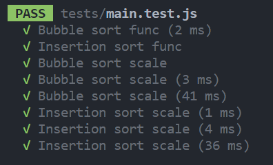

# Algorithm sorting tester  

This program:  
- Generates a list of x numbers  
- Sorts them using either bubble or insertion sort  
- Returns the sorted list alongside the ammount of time taken  

### TODO  
- Took x amount longer than y if program ran using both sorts  
- Run multiple times and take average??  
- Auto deploy to docker container  
- Branch with web UI as well - react + express  

## Testing
Run "npm run test" to run the test suite in [main.test.js](./tests/main.test.js)  
  

In addition to this to test user input I used the following tests:  
- Input 1:  
- Erroneous - "A"  
  

- Out of range - "-1"  
  

- Boundary - "2"  
  

- Input 2:  
- Erroneous - "A"  
  

- Valid - "B"  
  

- Valid - "I"  
  

- Input 3:  
- Erroneous - "A"  
  

- Valid - "Y"  
  

- Valid - "N"  
  