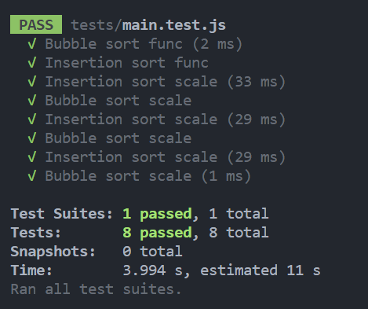

# Algorithm sorting tester

This program:
- Generates a list of x numbers
- Sorts them using either bubble or insertion sort
- Returns the sorted list alongside the ammount of time taken

### TODO
- Took x amount longer than y if program ran using both sorts
- Run multiple times and take average??
- Auto deploy to docker container
- Branch with web UI as well - react + express

## Testing
Run "npm run test" to run the test suite in main.test.js

In addition to this to test user input I used the following tests:
    - Input 1:
        - Erroneous - "A"
        
        PASS

        - Out of range - "-1"
        
        PASS

        - Boundary - "2"
        
        PASS
    
    - Input 2:
        - Erroneous - "A"
        

        - Valid - "B"
        

        - Valid - "I"
        

    - Input 3:
        - Erroneous - "A"
        
        
        - Valid - "Y"
        

        - Valid - "N"
        